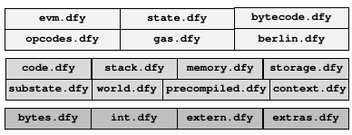

# Table of Contents

1. [Table of Contents](#table-of-contents)
2. [Overview](#overview)
3. [Architecture](#architecture)
4. [Source Files](#source-files)
	1. [High Level](#high-level)
	2. [Mid Level](#mid-level)
	3. [Low Level](#low-level)

# Overview

The [evm-dafny](https://github.com/ConsenSys/evm-dafny) repository contains five directories and five stand-alone files the most remarkable of which are the following:

- [`github/workflows`](.github/workflows) consists of the build process of different modules and their dependencies,
- [`fixtures`](https://github.com/ethereum/tests/tree/9d91961e98e97ba319e089f31388d4685da9b362) contains the ethereum tests to generate, to test our system against,

- [`resources`](resources) contains the log of tests which have been generated and our system is tested against,

- [`src`](src) comprises the backbone of our system including the formal semantics of the Dafny-EVM. It contains three subdirectories:

	- [`dafny`](src/dafny) consists of the Dafny-EVM Source Files as explained further below,
	- [`main`](src/main/java) includes the Java interface to the Dafny,
	- [`test`](src/test) contains simple tests implemented in dafny for checking the correctness of different opcodes

- [`tests`](tests) consists of the list of ethereum tests we are currently running,

- [`build.gradle`](build.gradle) consists of build instructions with the `gradle` tool,

We organize the [Source Files](#sourceFiles) of the Dafny-EVM according to a three-layer architecture explained further below.
# Architecture

The architecture of the [Source Files](#sourceFiles) comprises the three layers; top, middle and the bottom layer, as shown in the image below. The top of the stack image, shows the [High Level] modules containing bytecode semantics and top-level types.  We locate in the middle of the image, modules of the [Middle Level](#mid) which contain abstractions of the main components.  The bottom of the stack depicts the modules placed at the [Low Level](#low) which specify fundamental primitives (e.g. for manipulating bytes and ints).

    

# Source Files

The source files including our formalisation of the EVM semantics, the state, gas calculations, and helper modules appear under the directory [`src/dafny`](/src/dafny). The architecture of the source files accords with the three layer model explained above.

## High Level

- [`evms`](src/dafny/evms) contains modules each of which specify an extension of our EVM with a particular hardfork of users' choice, for example [`berlin.dfy`](src/dafny/evms/berlin.dfy).

- [`opcodes.dfy`](src/dafny/opcodes.dfy) encodes all of the EVM opcodes.

- [`evm.dfy`](src/dafny/evm.dfy) provides a generic mechanism for building extensions on our EVM based on a hardfork of users' choice.

- [`evmstate.dfy`](src/dafny/evmstate.dfy) specifies various EVM states and how to perform operations on them.

- [`bytecode.dfy`](src/dafny/bytecode.dfy) includes the implementation of the EVM opcodes' semantics.

- [`gas.dfy`](src/dafny/gas.dfy) specifies gas charging calculations.

## Mid Level
- [`code.dfy`](src/dafny/core/code.dfy) is an implementation of read-only code region of the EVM.
- [`context.dfy`](src/dafny/core/context.dfy) implements the execution context of a transaction.
- [`memory.dfy`](src/dafny/core/memory.dfy) is a specification of the EVM's volatile memory.
- [`precompiled.dfy`](src/dafny/core/precompiled.dfy) implements precompiled contracts.
- [`stack.dfy`](src/dafny/core/stack.dfy) specifies the stack of EVM together with stack operations.
- [`storage.dfy`](src/dafny/core/storage.dfy) is an implementation of the EVM storage including functionalities for performing operations on the storage.
- [`substate.dfy`](src/dafny/core/substate.dfy) encodes the substate of the EVM.
- [`worldstate.dfy`](src/dafny/core/worldstate.dfy) specifies the world state of the ethereum.

## Low Level

- [`option.dfy`](src/dafny/util/option.dfy)
- [`bytes.dfy`](src/dafny/util/bytes.dfy) implements an specification of machine bytes together with methods for performing operations on them.
- [`int.dfy`](src/dafny/util/int.dfy) specifies machine words of various length both signed and unsigned.
- [`extern.dfy`](src/dafny/util/extern.dfy) interfaces Dafny with Java.
